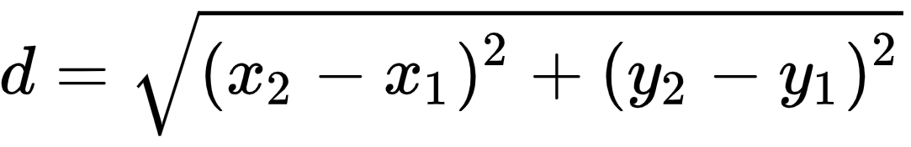

# Start to End

`LineSegment` is een class die een lijnstuk voorstelt. De class `LineSegment` bestaat intern uit een `start` `Point` en een `end` `Point`, waarbij `Point` een class is die de `x` en `y` coördinaten bijhoud.

Breid de class `LineSegment` uit met de methode `Length()` die de lengte van het lijnstuk teruggeeft als `double`.

Je kan hiervoor volgende formule gebruiken:



De `Main()` is reeds voorzien van een `Console.WriteLine` die de methode aanroept. Je dient deze wel uit commentaar te halen.

Je mag de `Main()` methode aanpassen / uitbreiden als je dit nodig vind.

Probeer er echter wel voor te zorgen dat je project op het einde compileert. Desnoods zet je niet-werkende code in commentaar.

## Verwachte output

```text
Welcome to Start to End

The length of the segment is 12.5299640861417
```

## Unit Tests

Het project wordt tevens vergezeld van Unit Tests. Gelieve deze te runnen. Merk wel op dat je build errors zal krijgen zolang de `Length()` methode niet bestaat.
